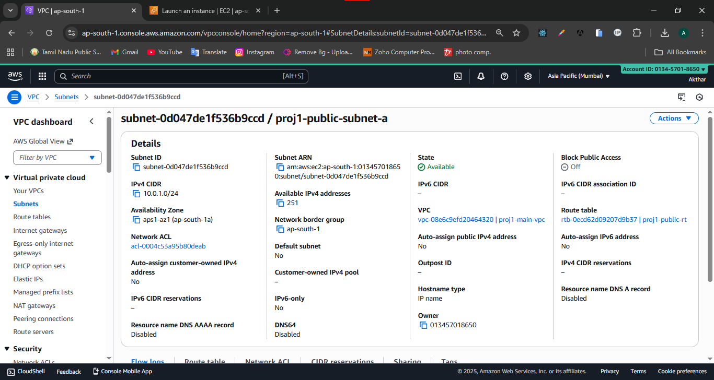
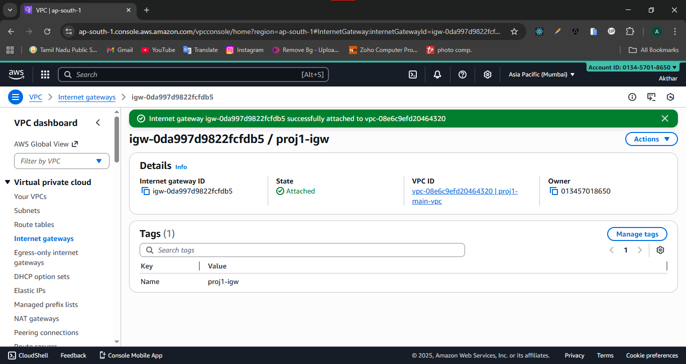
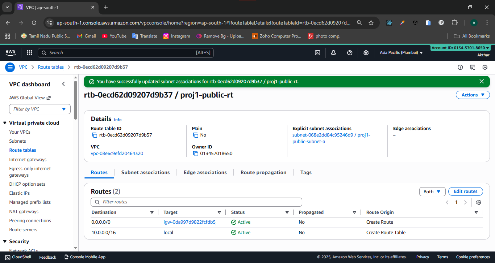
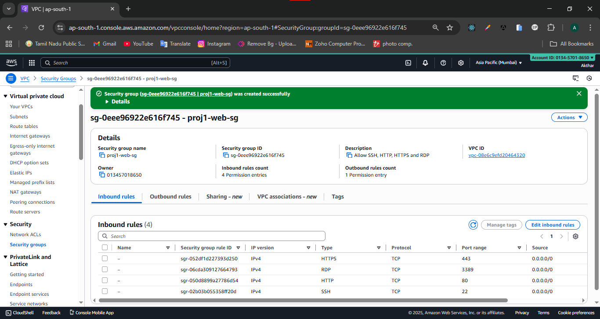
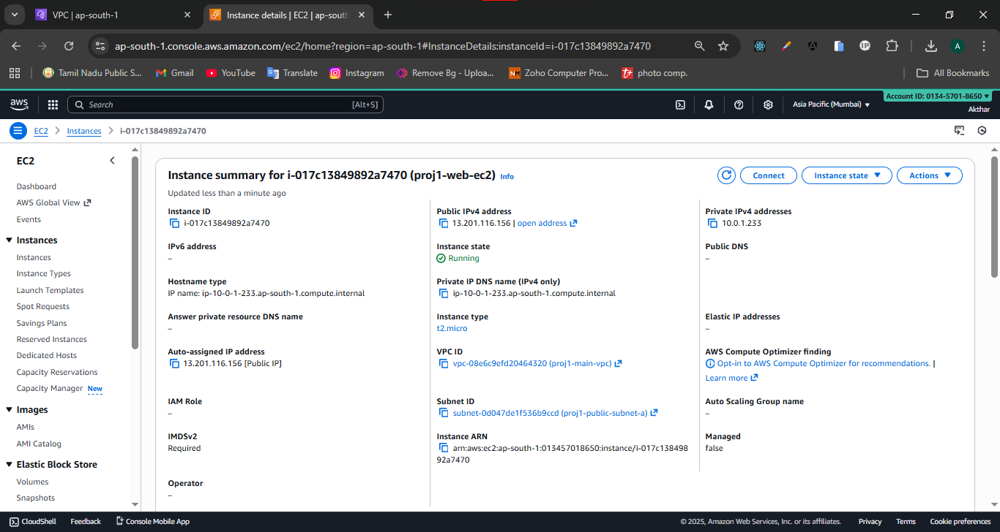
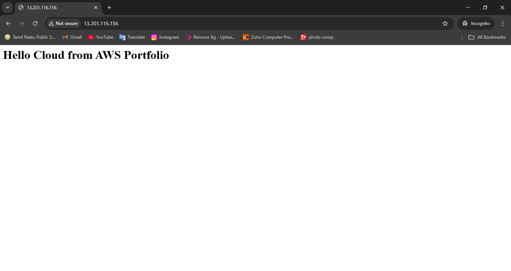
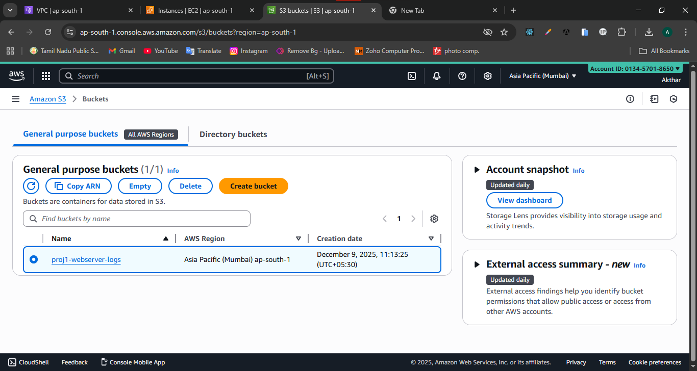
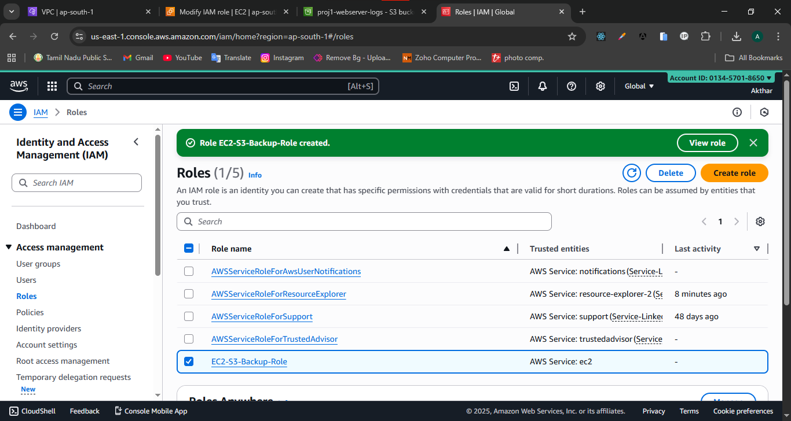
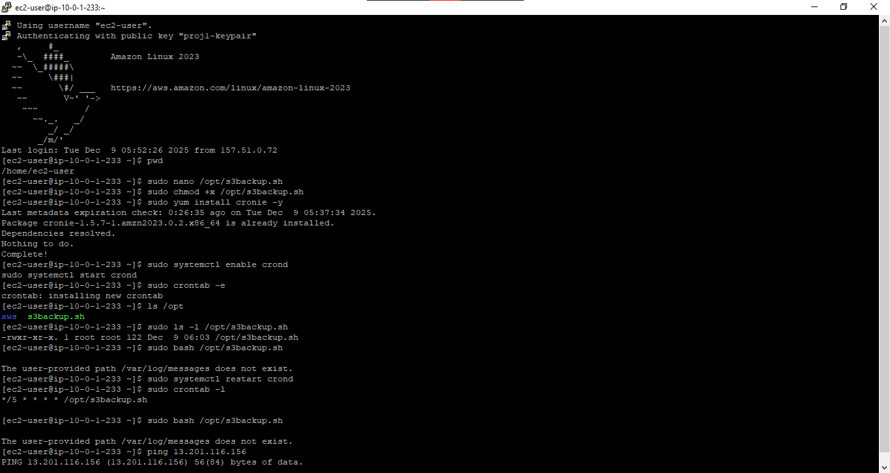
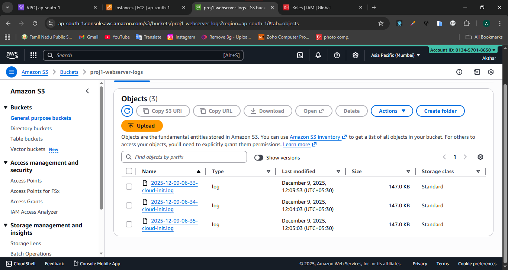

# Secure AWS VPC Architecture with EC2 Web Server & Automated S3 Backups

## 🎯 Objective

`Built a secure AWS network using custom VPC, deployed Apache EC2 server with bootstrapping user-data, and implemented automated log archival to S3 using IAM role authorization and Linux cron automation.`

---

## 📌 Services Used

- Amazon VPC
- EC2
- S3
- IAM
- Linux
- Cron

---

# 🏗 Architecture Overview

     Client
    (Browser)
       |
    Internet
       |

┌───────────────┐
│ Internet GW │ |
└──────┬────────┘
|
┌───────────────┐
│ Public Subnet │→ (10.0.1.0/24)
└──────┬────────┘
|
┌──────────────┐
│ EC2 Instance │→ Apache Web Server
│ Amazon Linux │
└──────┬───────┘
|
┌──────────────┐
│ IAM Role │ |→ AmazonS3FullAccess
└──────┬───────┘
|
┌──────────────┐
│ S3 Bucket │→ Logs Backup
└──────────────┘

---

# 🟦 Services Used

| Service          | Purpose            |
| ---------------- | ------------------ |
| **VPC**          | Network foundation |
| **EC2**          | Web server host    |
| **S3**           | Backup logs        |
| **IAM**          | Role-based access  |
| **Linux + Cron** | Automation         |

---

# ⭐ STEP-1 Create VPC

- Go to AWS Console → **VPC**

#### Create VPC

- Name: proj1-main--vpc
- IPv4 CIDR: 10.0.0.0/16

#### Create Public Subnet

- Name: proj1-public-subnet-a
- CIDR: 10.0.1.0/24
- AZ: ap-south-1
- Auto-assign public IP → ENABLE

#### Create Internet Gateway

- Name: proj1-igw
- Attach to **proj1-main-vpc**

#### Create Route Table

- Name: proj1-public-rt
- Route → 0.0.0.0/0 → internet gateway \* Subnet association → public subnet

#### Create Security Group

- Name: proj1-web-sg \* Attach to **proj1-main-vpc**
- Inbound Rules: SSH, HTTP(optionally HTTPS RDP).

---

# ⭐ STEP-2 Launch EC2

- AWS Console → EC2 → Launch Instance

#### Launch EC2 Instances

- Name: proj1-web-ec2
- OS: Amazon Linux 2
- Instance type: t2.micro
- Network: proj1-main-vpc
- Subnet: proj1-public-subnet-a
- Auto-public IP: ENABLE
- Security Group: Choose Existing Security Group
- Additional Configuration:-
  - User Data :

### User Data Script

```bash
#!/bin/bash
yum update -y
yum install httpd -y
systemctl enable httpd
systemctl start httpd

cd /var/www/html
echo "<h1>Hello Cloud from AWS Portfolio</h1>" > index.html
```

- test: 👉 Copy public IP => http://13.201.116.156/(Example)

# ==> `Launch Instances` <==

---

# ⭐ STEP-3 Configure S3 Backup Automation

- AWS Console → S3 → Create a Bucket

## Create S3 bucket

- bucket name: proj1-webserver-logs

---

# ⭐ STEP-4 Create IAM Role

- AWS Console → IAM → Roles → Create Role → EC2 → AmazonS3FullAccess → Name: EC2-S3-Backup-Role

---

## ⭐ STEP-5 Attach Role to EC2 Instances

- EC2 Instances → Actions → Instance Settings → Modify IAM → Attach EC2-S3-Backup-Role → Save Changes

---

## ⭐ STEP-6 Create Backup Script

### Linux Commands

```bash
→ pwd
→ ls /var/log(Optional, But Check it once)
→ sudo nano /opt/s3backup.sh
    #!/bin/bash
    # Log file to backup
    LOG_FILE="/var/log/cloud-init.log"
    # Timestamp
    timestamp=$(date +%F-%H-%M)
    # Upload to S3
    aws s3 cp "$LOG_FILE" "s3://proj1-webserver-logs/${timestamp}-cloud-init.log"
→ sudo chmod +x /opt/s3backup.sh
→ sudo yum install cronie -y
→ sudo systemctl enable crond
→ sudo systemctl start crond
→ sudo crontab -e
    */1 * * * * /opt/s3backup.sh
→ ls /opt
→ sudo ls -l /opt/s3backup.sh
→ sudo bash /opt/s3backup.sh (`Manual Command if Does not Work Automated Cron Command`)
```

Backup will now run every 1 minutes 😎

---

# 📌 Validate Automation

Open S3 bucket and confirm log files appear like:

- 2025-12-09-10-30-cloud-init.log
- 2025-12-09-10-31-cloud-init.log

---

## 📸 Screenshots

### VPC Settings


### Subnet Setup



### Internet Gateway



### Route Table



### Security Group



### EC2 Page



## Public IP Output



### S3 bucket Creation



### IAM Role



### Linux Shell Commands



### S3 Backup Logs


